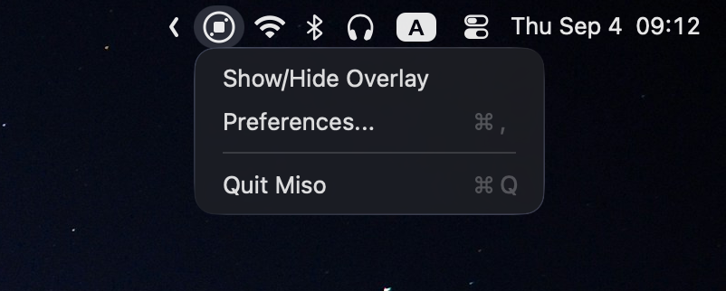

# MISO - Method Input Switch Overlay

A lightweight macOS menu bar utility that provides a floating HUD overlay for quick input method switching.


## Features

- **🚀 Zero Permissions Required** - Core functionality works immediately without setup.
- **🎯 HUD-Style Overlay** - A beautiful floating interface for quick switching.
- **⚡ Native Performance** - Built with AppKit and SwiftUI for optimal speed.
- **🎨 Customizable** - Configure which input methods to display.
- **📱 Menu Bar Integration** - Lives quietly in your menu bar.
- **💾 Position Memory** - Remembers the overlay position across launches.
- **🔄 Auto-Detection** - Automatically discovers system input methods.

## Screenshots

 

## Installation

### Requirements

- macOS 12.0 (Monterey) or later.
- No additional permissions are required for the core functionality.

### Installation

Miso can be installed via Homebrew or by manually downloading the latest release.

#### Homebrew

```bash
brew tap hewigovens/tap
brew install --cask miso
```

#### Manual Download

Download the latest release from the [GitHub Releases](https://github.com/hewigovens/Miso/releases) page. Unzip the downloaded file and drag `MISO.app` to your Applications folder.

### Build from Source

```bash
git clone https://github.com/hewigovens/miso.git
cd miso
open Miso.xcodeproj
```

Build and run in Xcode 16.0 or later.

## Usage

### Quick Start

1. **Launch MISO** - Look for the 🌐 icon in your menu bar.
2. **Configure Methods** - Click the menu bar icon, then select "Preferences..." to set up your input methods.
3. **Use Overlay** - Click "Show/Hide Overlay" to toggle the floating HUD.

### Overlay Controls

- **Click an input method** to switch immediately.
- **Drag the overlay** to reposition it anywhere on the screen.
- The position is automatically saved.

### Configuration

Open **Preferences** to:
- **Refresh from system** to detect new input methods.
- **Open Input Sources Settings** to configure system input methods.
- **Toggle launch at login** (requires macOS 13+).

## How It Works

MISO uses macOS's built-in **Text Input Source APIs**, which require no special permissions:

- `TISCopyCurrentKeyboardInputSource()`: Detects the current input method.
- `TISSelectInputSource()`: Switches between input methods.
- `TISCreateInputSourceList()`: Discovers available methods.

This makes MISO a **zero-permission** utility that works immediately after installation.

## Architecture

MISO is built with modern Swift patterns:

- **MVVM Architecture**: For a clean separation of concerns.
- **Protocol-Oriented Design**: To ensure testable and maintainable code.
- **SwiftUI + AppKit Hybrid**: Combining the best of both frameworks.
- **Reactive UI**: For real-time updates with Combine.

See [AGENTS.md](AGENTS.md) for detailed technical documentation.

## Contributing

Contributions are welcome! Please feel free to submit a pull request.

### Development Setup

1. Clone the repository.
2. Open `Miso.xcodeproj` in Xcode 14.0 or later.
3. Build and run the project.

### Code Style

- Follow standard Swift naming conventions.
- Use the MVVM pattern for new features.
- Add protocol interfaces for services.
- Write unit tests for business logic.

## License

This project is licensed under the MIT License - see the [LICENSE](LICENSE) file for details.

## Support

- **Issues**: [GitHub Issues](https://github.com/hewigovens/Miso/issues)
- **Discussions**: [GitHub Discussions](https://github.com/hewigovens/Miso/discussions)

---

Made with ❤️ for the macOS community
