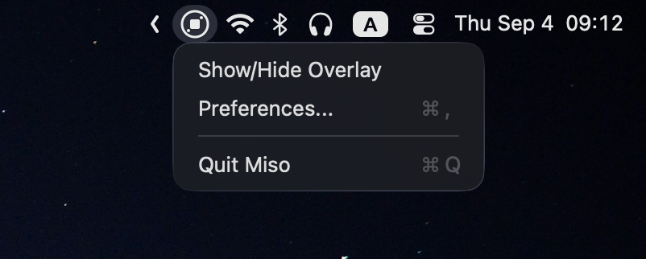

# MISO - Method Input Switch Overlay

[](https://github.com/hewigovens/Miso/actions/workflows/ci.yml)


A lightweight macOS menu bar utility for quick input method switching via a floating HUD overlay. Zero permissions required.

 

## Install

### Homebrew

```bash
brew tap hewigovens/tap
brew install --cask miso
```

Or download from [GitHub Releases](https://github.com/hewigovens/Miso/releases).

## Usage

1. Launch MISO — look for the icon in your menu bar
2. Open Preferences to configure which input methods to display
3. Toggle the floating HUD overlay from the menu
4. Click any input method to switch immediately
5. Drag the overlay to reposition it

MISO uses macOS Text Input Source APIs, which require no special permissions.

## Contributing

See [CONTRIBUTING.md](CONTRIBUTING.md).

## License

BSL 1.1 — free to use, modify, and redistribute; paid app store distribution requires permission. Converts to Apache-2.0 on 2030-03-23. See [LICENSE](LICENSE).
